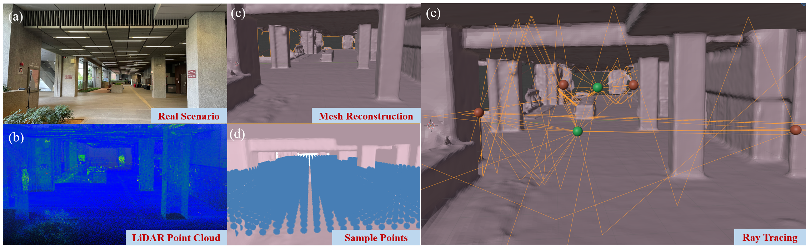
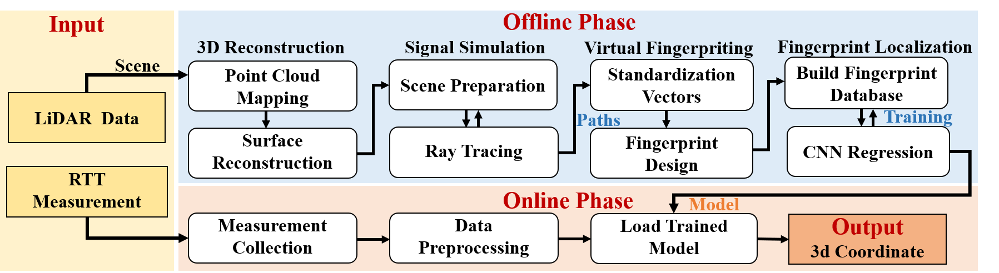

# R2TT

    

**R2TT: High-Accuracy 3D Localization Using Ray-Tracing-Based Wi-Fi RTT Virtual Fingerprints for Challenging Scenarios.** 

**R2TT** R2TT (Ray-Tracing Round-Trip Time) is a high-precision 3D indoor positioning system that combines the advantages of fingerprint-based and ranging-based methods by leveraging virtual RTT ranging fingerprints. The proposed method consists of two stages: (1) constructing a virtual RTT fingerprint database using low-cost light detection and ranging (LiDAR) and ray tracing techniques and (2) employing deep learning to capture signal reflection characteristics for robust and high-accuracy localization. 

**Authors**: Xin Wang, The Hong Kong Polytechnic University.

**Contact**: Technical issue: [xinxx7.wang@polyu.edu.hk](xinxx7.wang@polyu.edu.hk).

## System pipeline

    

The proposed method consists of two stages: 
(1) constructing a virtual RTT fingerprint database using low-cost light detection and ranging (LiDAR) and ray tracing techniques
and (2) employing deep learning to capture signal reflection characteristics for robust and high-accuracy localization. 

## **Data**
Coming Soon~
